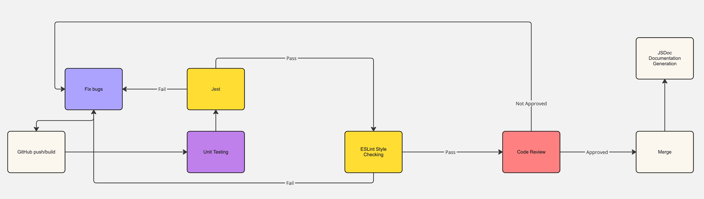

# CI/CD Pipeline Phase 1 
Due to the limited timeframe of a few weeks for our DevJournal project, we have established essential components in our first phase of our CI/CD pipeline to create a smooth development and deployment processes.

## Structure
Our CI/CD pipeline is made to smoothly automate code-integration, testing, quality analysis, and deployment. These are the stages of our phase 1 pipeline:

1. **Source Control Integration**: Changes that are pushed to the main branch trigger our pipeline.
2. **Build**: Code is compiled, dependencies are resolved, and essential artifacts are generated. Ensures that code is ready for testing and deployment.
3. **Testing**: Unit tests check the functionality of components and determine merge eligibility.
4. **Code Quality Analysis**: Static code analysis tools such as linting enforce coding standards and flag potential issues.
5. **Deployment**: Program is placed into staging environments for additional testing or to be made ready for operational usage.

## Current Functionalities
### Source Control Integration
- Automatically triggers the pipeline when changes are pushed to the main branch on GitHub.
- Supports branch-specific pipelines for feature branches and pull requests.

### Build
- Utilizes Jest for JavaScript testing, ensuring code correctness and mergability between branches.
- The build process causes the code to compile and manages dependencies, producing essential artifacts.  
- Said artifacts created during the build process are then used in next stages of our pipeline.

### Testing
- Performs Jest unit tests to check individual components.
- Determines merge eligibility between branches based on test results.

### Code Quality Analysis
- Implements ESLint Airbnb configuration to maintain code style/standards and catch possible errors.
- Requires peer code review and approval before merging changes into the main branch.

### Deployment
- Manual deployment to staging environments for further testing or production (preview deployment to come).

### Task Management
- Issues and tasks are created and assigned to team members on GitHub.

### Documentation
- Using JSDoc to document our code due to the clarity and maintainability.

### Diagram of Current Phase 1 Functionalities
  

## Next Steps
- **Enhance Our Testing**: Expand test coverage, include functionality testing.
- **Streamline Preview Deployment**: Automate preview deployment processes.

## Our plans for phase 2 and beyond

- **Electron Build**: We are going to create a workflow to build executables using the Electron build process. The workflow will run on Ubuntu, Windows, and MacOS to generate executables and artifacts for all of these platforms. This way our program will be multiplatform.
- **Codacy Code Analysis**: We will integrate Codacy analysis tools in our repository to analyze code coverage and code quality when merging to `main`
- **E2E Testing**: We will add E2E and functional testing to our program using either `Playwright` or `Puppeteer`. We will add GitHub workflows for these tests and add the status checks to pull request to improve code quality.