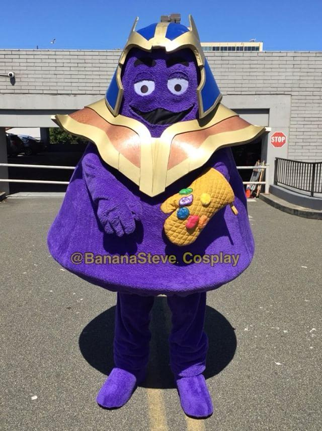

# Kickoff Meeting - Infinite Loops (Team 12)

**Type of meeting**: Zoom/online \
**Date & Time**: 4/13/24 @ 1pm

## Attendance

- [x] Lindsey Rappaport
- [x] Ramtin Tajbakhsh
- [x] Eban Covarrubias
- [x] Guan Huang Chen
- [x] Ibraheem Syed
- [x] Jordan Chang
- [x] Matthew Williams
- [x] Ritviksiddha Penchala
- [x] Sidhant Singhvi
- [x] Sophia Davis
- [ ] Wen Hsin Chang

## Agenda

- Mascot and other branding elements
- Theme of the team
- Choice of communication platform
- Group policiy agreements

## Unresolved Business from the Previous Meeting

N/A since this was the first team meeting.

## New Business to be Discussed

- Discussed the mascot of the team
  - Thanos (infinite loops -> infinite wars)
  - Other avenger heros?
- Theme of the team
  - Infinity War/Avengers
  - Fractals? (They unravel infinitely)
- Logo
  - The design is currently in progress by **Sophia**
- Response time policy
  - Check Slack at least once a day (24 hour response time)
  - Acknowledge information coming in in some way
  - In emergency situations, contact through phone numbers
- Pair programming
  - People seem to be generally comfortable with the idea
- Different Roles
  - Developer
  - Designer
  - Meeting Note Taker
  - Qualiry Assurance
  - Builders/developers
- Testing Methodology
  - Every person writes their own tests
  - QA from other members through code reviews
  - Potentially one assinged QA person

## Conclusion

### Decisions and Reasoning

- Mascot will be Thanos, specifically this one:

- Theme will be Infinity Wars since there are a lot of material to work with
- People should respond/react to messages within 24 hours
- Stand-up meetings with TA are optional for all members besides team leaders
  - We most likely won't have other weekly team meetings
- We will assign roles to people once we have a better idea about what the project is
- We will use Slack as our primary form of communication

### Action Items

- [ ] Please write bio snippets in the shared document on Slack
- [ ] Submit headshots via email to **Lindsey**

**Meeting ended at: 1:30pm**
