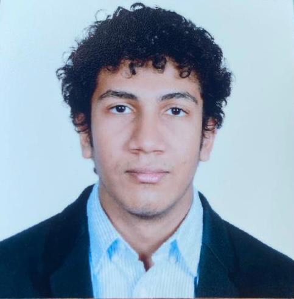

# Infinite Loops

## Branding

### Logo

TODO

### Mascot

Since our team name is **Infinite Loops**, we thought we could draw inspiration from **Avengers: Infinity War**. So we chose **Thanos** to be the mascot of our team.
Here is a picture of what we had in mind:

### Theme

With the same reasoning as above, the theme for our team is **Avengers: Infinity War** and we thought we could also incorporate some elements from fractals in our designs.

The introduction video of our team can be found here: [Video](videos/teamintro.mp4)

## Our Values

- Communication:
  - Responding to team mates in a timely manner
  - Being open, honest, and upfront by sharing project updates regularly, voicing concerns early, and discussing uncertainties as they arise
  - Reaching out for help whenever needed. Asking for help is a strength and an opportunity for collaboration and learning, not a weakness
  - Openly praising each other for efforts and achievements
  - Sharing constructive criticisms for areas needing improvement and missed opportunities
- Comraderie:
  - Promoting psychological safety within the team
  - Covering for each other during hard times
  - Helping each other out whenever needed

## Memes and random stuff that we think are important :)

## Team Members

### Lindsey Rappaport

Role: Leader

GitHub Account: [Lindsey](https://github.com/lindseyrapp) 

Bio: My name is Lindsey Rappaport & I am a Computer Science major at UCSD. I transferred from Palomar College after earning my Associate’s for Transfer in Mathematics. I currently work as a student researcher for Lawrence Berkeley National Lab where I design metabolic pathway map SVG's & embed code into the images to allow for multi-omics data to be projected upon them, as well as contribute to a native JS app to help researchers filter and identify the pathway maps that are most relevant to their data. In the future, I'd like to be a software engineer and guide teams as a project leader. In my free time, I am a published singer/songwriter/musician, model, & avid sudoku player.

### Ramtin Tajbakhsh

Role: Leader

GitHub Account: [Ramtin](https://github.com/ramtintjb)

Bio: Hi! My name is Ramtin Tajbakhsh and I’m a third-year CS major at UCSD. I’m currently working as a Developer at Triton Software Engineering and we are developing a web application for the Union Station Homeless Services so that they can keep track of their information and referrals in an organized way. I love working out, mostly calisthenics, powerlifting, and bouldering. I also enjoy reading fantasy novels and taking naps.

### Eban Covarrubias

Role: Developer

GitHub Account: [Eban](https://github.com/Eban-Covarrubias)

Bio: Hello, My name is Eban Covarrubias. I am a third year computer engineering major at UCSD. I am hoping to get a career in either software engineering or computer systems. My hobbies include playing ping pong, climbing, and weight lifting. I plan to use this class to grow both my technical skills and my soft skills, particularly in teamwork settings.

### Guan Hao Huang Chen

Role: Developer

GitHub Account: [Guan](https://github.com/ghuangchen01)

Bio: 

### Ritviksiddha Penchala

Role: Developer

GitHub Account: [Ritviksiddha](https://github.com/ritvikpen)

Bio: My name is Ritviksiddha Penchala and I’m a Computer Science major at UCSD. I’m in my third year at this school and have loved it so far! I work with the Sanchez-Roige and Saier Labs to carry out bioinformatics analyses on campus and also work as a Software Intern at CAIDA. I love learning in these hands-on ways and am glad UCSD has offered me so many opportunities to do so. I hope to pursue a career in bioinformatics research. In my free time, I enjoy hiking, photography, reading, and playing video games. 

### Matthew Williams

Role: Developer

GitHub Account: [Matthew](https://github.com/matt0923)

Bio: My name is Matthew Williams and I’m a Computer Science major here at UCSD. This is my first year at UCSD, I transferred in from Palomar Community College in San Marcos. In my free time, I like to hang out around the beach, go to the gym, and play video games. After my time at UCSD, I hope to have a long and successful career in Software Engineering.

### Ibraheem Syed

Role: Developer

GitHub Account: [Ibraheem](https://github.com/soccerplayer6)

Bio: My name is Ibraheem Syed and I’m a Computer Science major at UCSD. I transferred to UCSD after earning my Associates in Mathematics and Associates in Computer Science. I plan on going into either embedded systems or software engineering as a career path in the future. In my free time, I enjoy playing and watching basketball, and volunteering as a camp counselor.

### Sidhant Singhvi

Role: Developer

GitHub Account: [Sidhant](https://github.com/sidhantsinghvi)

Bio: My name is Sidhant Singhvi, and I'm a computer engineering major. I’m interested in circuits and  systems, and SE. In my free time, I like to go hiking, play table tennis, and chess.

### Wen Hsin Chang

Role: Developer

GitHub Account: [Wen](https://github.com/whc004)

Bio: Hi! My name is Wen Hsin Chang and I am a second-year transfer student at UCSD, majoring in Computer Science. This is my second year at UCSD and I am transferred from Irvine Valley College in Irvine. I do not attend the whole year in UCSD because I have to be back to Taiwan to fulfill my mandatory military service, that’s the reason I take this class so late and take some more time to graduate. In my free time, I like to go snowboarding and play video games with friends.

### Sophia Davis

Role: Developer

GitHub Account: [Sophia](https://github.com/sadsoap)

Bio: Hello! My name is Sophia Davis, I am a third-year transfer student at UCSD, majoring in Computer Science. I regard myself as a very creative person, and as a result hope to eventually work as a UI/UX designer. My general interests and hobbies tend to follow the same theme; I enjoy puzzles, sculpting, crochet, and a variety of other art forms.

### Jordan Chang

Role: Developer

GitHub Account: [Jordan](https://github.com/jordan35chang)

Bio: My name is Jordan Chang  and I’m a Computer Science major at UCSD. I am currently in my second year at UCSD, and plan to go into software engineering in the future. In my free time, I like to workout and play basketball.
